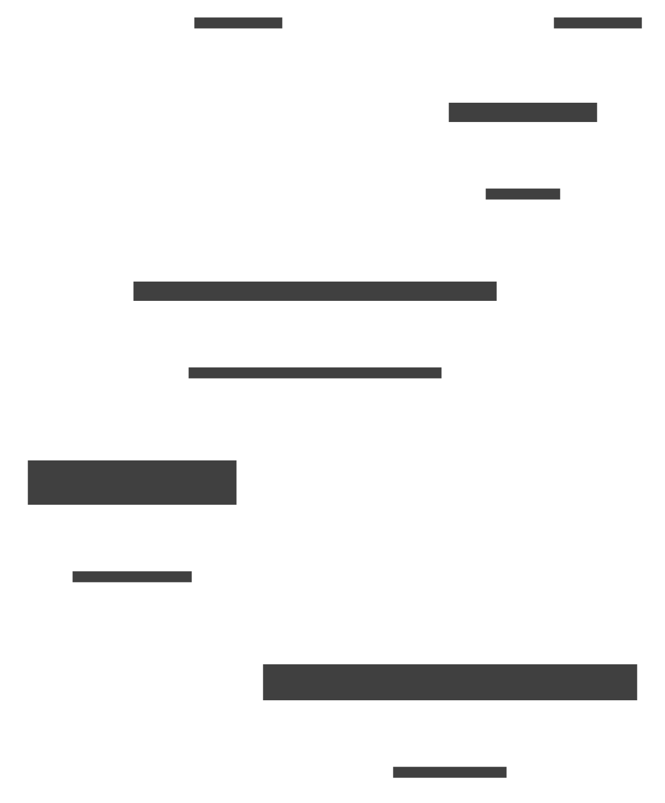

# copre (Contextual Presence) - Change Prediction Logic

This Go package analyzes differences between two versions of text (`oldText` and `newText`) to predict subsequent, similar changes. Currently, it focuses on predicting repeated *deletions*.

## Purpose

Given an initial change (represented by the difference between `oldText` and `newText`), the core function `PredictNextChanges` identifies the text that was *removed* during that initial change. It then searches the `oldText` for other occurrences of the same removed text block that exist in a similar immediate context (specifically, on the same line). The goal is to find the most likely locations in the `newText` where the *same deletion* might be applied next, based on the pattern established by the first edit.

This is useful in scenarios like:
*   **Repetitive Refactoring:** If a user deletes a specific log statement or code pattern in one place, this library can predict where else they might want to delete it.
*   **Automated Edit Assistance:** Suggesting follow-up edits based on an initial user action.

## How it Works

The primary entry point is `copre.PredictNextChanges(oldText, newText)`.

1.  **Diff Calculation:** It uses `go-diff/diffmatchpatch` to compute the differences between `oldText` and `newText`.
2.  **Initial Change Analysis:** It analyzes the diffs to identify the first block of text that was removed (`charsRemoved`) and its original starting position (`originalChangeStartPos`) in `oldText`. *(Note: Currently focuses only on the first detected removal)*.
3.  **Anchor Finding & Scoring:**
    *   It searches `oldText` for all other occurrences of `charsRemoved`, excluding the one at `originalChangeStartPos`. These potential locations are called "anchors".
    *   For each anchor and the original occurrence, it extracts the immediate preceding text (prefix) and following text (affix) *on the same line*.
    *   Anchors are scored based on the similarity of their prefix/affix to the original occurrence's prefix/affix. Higher scores indicate a stronger contextual match.
4.  **Position Mapping:** Each anchor's position (which is relative to `oldText`) is mapped to its corresponding byte position in `newText` using the diff information. This accounts for how the text shifted due to the initial edits.
5.  **Prediction Generation:** For each scored anchor, if the `charsRemoved` text exists at the calculated `mappedPosition` in `newText`, a `PredictedChange` object is created. This object represents the suggestion to remove `charsRemoved` at `mappedPosition` in `newText`.
6.  **Output:** The function returns a slice of `PredictedChange` structs, each containing:
    *   `Position`: The starting byte position (0-indexed) of the *original anchor* within `oldText`.
    *   `TextToRemove`: The string that was identified as removed in the initial change and is suggested for removal again.
    *   `Line`: The 1-indexed line number where the *original anchor* begins in `oldText`.
    *   `Score`: The calculated similarity score based on context matching. Higher scores indicate a potentially better prediction.
    *   `MappedPosition`: The calculated starting byte position (0-indexed) in `newText` where the removal is predicted to occur.

## Usage

Import the package and call `PredictNextChanges`:

```go
package main

import (
	"fmt"
	"log"

	"github.com/jsnanigans/copre/pkg/copre" // Adjust import path as needed
)

func main() {
	oldText := `line one-two-smile
line two-smile
line 3-smile`
	newText := `line one-two-smile
line two
line 3-smile`

	// Predict where else "smile" might be removed
	predictions, err := copre.PredictNextChanges(oldText, newText)
	if err != nil {
		log.Fatalf("Error predicting changes: %v", err)
	}

	// The prediction suggests removing "smile" at MappedPosition in newText
	for _, p := range predictions {
		fmt.Printf("Prediction: Remove %q at position %d (score: %d) in new text (origin line %d in old text)\n",
			p.TextToRemove, p.MappedPosition, p.Score, p.Line)
	}

	// Optionally visualize the predictions
	visualized := copre.VisualizePredictions(newText, predictions)
	fmt.Println("\n--- Visualization ---")
	fmt.Println(visualized)
	fmt.Println("---------------------")
    /*
--- Predicted Changes Preview ---
line one-two<red|-smile|>
line two
line 3<red|-smile|>
    /*
}
```

## Visualization

The package includes a helper function `copre.VisualizePredictions(text, predictions)` which takes the `newText` and the slice of `PredictedChange` structs. It returns a string where the `TextToRemove` for each prediction is highlighted (typically in red using ANSI codes) at its corresponding `MappedPosition`. This provides a quick way to see where the predicted changes would occur.

## Limitations & Future Work

*   Currently focuses only on predicting repeated *deletions* based on the *first* detected deletion in the diff.
*   Anchor scoring is based on immediate context *on the same line*.
*   Future work could involve predicting insertions or replacements, considering multiple changes in the initial diff, and refining the scoring mechanism.

## Diagram



